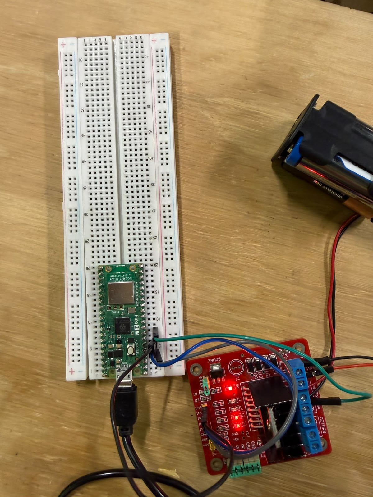

# Sesión 06 - PWM + Puente H L298N + Motor DC

_Trabajo en equipo: Angel Rugerio Jiménez · 201720 — Axel García Arellano · 201251_

## 1. Objetivo

Controlar un motor DC con la Raspberry Pi Pico 2 W usando un puente H L298N. No solo quiero que el motor gire: quiero decidir **hacia dónde** gira (dirección), **qué tan rápido** gira (velocidad con PWM) y **cómo** cambia de un estado a otro (rampas y cambio seguro de dirección).

Todo lo programé en MicroPython y lo probé en Wokwi. En la simulación no modifiqué el circuito (`wokwi/diagram.json`); solo escribí `main.py`.

## 2. Circuito

| Señal | Pin de la Pico | Pin del L298N | Para qué sirve |
|---|---|---|---|
| IN1 | GP2 | IN1 | Dirección |
| IN2 | GP3 | IN2 | Dirección |
| ENA | GP4 (PWM) | EN A | Velocidad |
| GND | GND | GND | Tierra común |

La tierra común es obligatoria: si la Pico y el L298N no comparten GND, las señales de IN1, IN2 y ENA no tienen una referencia y el puente H no las entiende bien.

## 3. Qué es PWM y qué es el duty cycle

Un pin digital de la Pico solo puede estar en 0 V o en 3.3 V; no puede sacar "la mitad" de voltaje. PWM (modulación por ancho de pulso) es un truco: prendo y apago el pin muy rápido, muchas veces por segundo, y cambio cuánto tiempo pasa prendido en cada ciclo.

- **Frecuencia**: cuántos ciclos de prendido/apagado hay por segundo.
- **Duty cycle**: el porcentaje del ciclo que el pin está prendido.
  - 0 % → siempre apagado → motor parado.
  - 50 % → la mitad del tiempo prendido → el motor recibe más o menos la mitad de la potencia.
  - 100 % → siempre prendido → velocidad máxima.

El motor no alcanza a notar cada pulso por separado, así que se comporta como si recibiera un voltaje promedio. Por eso, al cambiar el duty cycle, cambio la velocidad.

### Por qué uso 100 Hz y no 1000 Hz

En clase se usó `ENA.freq(1000)`, pero con el motor real, a 1000 Hz y con duty bajo, el motor no arrancaba. Probamos con 100 Hz y funcionó, así que dejé `PWM_FREQ = 100`.

La explicación más probable (no la medimos con osciloscopio): el motor es una bobina y su corriente tarda un poquito en subir cada vez que llega un pulso. A 1000 Hz los pulsos son tan cortos que la corriente no alcanza a subir del todo; a 100 Hz cada pulso dura 10 veces más y el motor sí recibe la fuerza completa. Lo malo es que a 100 Hz el motor **zumba**, porque es una frecuencia que el oído alcanza a escuchar.

Todos los ajustes del motor están al inicio de `main.py`, para cambiarlos sin tocar la lógica:

```python
PWM_FREQ = 100          # Hz. Frecuencia baja = mas torque en motores chicos
MIN_DUTY = 40           # % real minimo con el que el motor SI gira (zona muerta)
KICK_MS = 120           # empujon al 100 % cuando arranca desde 0
```

### De porcentaje a `duty_u16()`

En MicroPython el duty cycle se da con `duty_u16()`, que acepta un número de 0 a 65535. Yo trabajo en porcentaje y la conversión la hace esta función:

```python
def _duty_real(percent):
    if percent == 0:
        return 0
    real = MIN_DUTY + (100 - MIN_DUTY) * percent / 100
    return int(real * 65535 / 100)
```

Aquí está la **zona muerta**: en el motor real, por debajo de ~40 % de duty el motor solo zumbaba y no giraba (el L298N se come cerca de 2 V y el motor necesita fuerza extra para empezar a moverse). Si `25 %` fuera 25 % real, la prueba de "velocidad baja" sería un motor quieto. Por eso separo dos cosas:

- **Porcentaje lógico** (0-100 %): lo que pide el programa y lo que se imprime en consola.
- **Duty real**: lo que llega a ENA. 0 % sigue siendo apagado, y del 1 al 100 % se reparte solo entre 40 % y 100 %, que es donde el motor sí se mueve.

| Lógico (consola) | Duty real en ENA | `duty_u16` |
|---|---|---|
| 0 % | 0 % | 0 |
| 25 % | 55 % | 36044 |
| 50 % | 70 % | 45874 |
| 75 % | 85 % | 55704 |
| 100 % | 100 % | 65535 |

Y esta es la función que uso en todo el programa para cambiar la velocidad:

```python
def set_speed(percent):
    global velocidad_actual
    percent = int(max(0, min(100, percent)))   # saturacion: 0 <= percent <= 100

    # Si venimos de 0 y vamos a movernos, empujon para vencer la inercia
    if velocidad_actual == 0 and percent > 0:
        ENA.duty_u16(65535)
        sleep_ms(KICK_MS)

    ENA.duty_u16(_duty_real(percent))
    velocidad_actual = percent
```

- `max(0, min(100, percent))` limita el valor para que nunca sea menor que 0 ni mayor que 100.
- **Empujón de arranque**: aun con la zona muerta, el motor no arrancaba desde reposo, porque para empezar a girar necesita más fuerza que para seguir girando. Entonces, cuando la velocidad pasa de 0 a algo mayor, pongo 100 % durante 120 ms y luego bajo al duty que toca. Una vez que el eje gira, el duty normal basta.
- Guardo la velocidad en `velocidad_actual` para saber siempre a qué velocidad va el motor. Uso `global` porque es una variable de todo el programa, no solo de la función.

## 4. IN1 / IN2 (dirección) y ENA (velocidad)

El L298N es un puente H: por dentro tiene interruptores que pueden mandar la corriente al motor en un sentido o en el otro. Yo lo controlo con tres señales:

| IN1 | IN2 | Resultado |
|---|---|---|
| 1 | 0 | FORWARD (gira en un sentido) |
| 0 | 1 | REVERSE (gira en el sentido contrario) |
| 0 | 0 | STOP (motor sin corriente) |
| 1 | 1 | Freno — **no lo uso** |

- **IN1 e IN2** solo deciden la **dirección**. Son pines digitales normales (0 o 1).
- **ENA** decide la **velocidad**. Es el pin donde meto el PWM. Si ENA está en 0 %, el motor no gira aunque IN1/IN2 digan FORWARD.

Los pines los creo ya en 0, para que el motor no se mueva al encender la Pico:

```python
IN1 = Pin(2, Pin.OUT, value=0)                   # GP2 - direccion
IN2 = Pin(3, Pin.OUT, value=0)                   # GP3 - direccion
ENA = PWM(Pin(4), freq=PWM_FREQ, duty_u16=0)     # GP4 - velocidad por PWM
```

Cada dirección es una función corta que escribe IN1/IN2 y guarda la dirección actual:

```python
def forward():
    global direccion_actual
    IN1.value(1)
    IN2.value(0)
    direccion_actual = ADELANTE

def stop():
    global direccion_actual
    set_speed(0)
    IN1.value(0)
    IN2.value(0)
    direccion_actual = DETENIDO
```

`reverse()` es igual que `forward()` pero con `IN1 = 0`, `IN2 = 1`. Para la dirección uso constantes numéricas (`DETENIDO = 0`, `ADELANTE = 1`, `REVERSA = 2`), como en la máquina de estados del examen.

`stop()` pone la velocidad en 0 % de inmediato, así que **antes** de llamarla siempre hago una rampa hasta 0 % (ver secciones 5 y 7). Ninguna función escribe `IN1 = IN2 = 1`.

## 5. Cómo funciona la rampa de aceleración y desaceleración

Si paso de 0 % a 100 % de golpe, el motor pide mucha corriente de un jalón y todo el sistema recibe un "tirón". Con una rampa, la velocidad sube (o baja) por pasos pequeños.

```python
def ramp_to(start, end, step=10, delay_ms=100):
    if start == end:
        set_speed(end)
        return

    if start < end:
        paso = abs(step)
        etiqueta = "Acelerando"
    else:
        paso = -abs(step)       # si start > end el paso debe ser negativo
        etiqueta = "Desacelerando"

    for speed in range(start, end, paso):
        set_speed(speed)
        print(f"{etiqueta}: {speed} %")
        sleep_ms(delay_ms)

    set_speed(end)
    print(f"{etiqueta}: {end} %")
```

Paso por paso:

1. Si `start` y `end` son iguales, solo fijo esa velocidad y termino.
2. Comparo `start` con `end` para saber si voy a subir o a bajar. Si subo, el paso es positivo y el mensaje dice "Acelerando". Si bajo, el paso es negativo y dice "Desacelerando". Así una sola función sirve para las dos cosas.
3. `range(start, end, paso)` me da los valores intermedios. En cada uno llamo a `set_speed()`, imprimo el porcentaje y espero `delay_ms`.
4. `range()` **no incluye** el último valor, así que al final aplico `set_speed(end)`. Esto también sirve cuando el paso no cae exacto: de 0 a 75 con paso 10, el `for` llega a 70 y la última línea deja el motor en 75.

En el programa llamo a la rampa con `PASO_RAMPA = 5` y `DELAY_RAMPA_MS = 100`. Una rampa completa de 0 a 100 % son 20 pasos de 100 ms, o sea **2 segundos**, que se ven bien tanto en Wokwi como en el motor real.

Un detalle: cuando la rampa arranca desde 0 %, el primer paso que no es 0 activa el empujón de 120 ms de `set_speed()`. La aceleración es progresiva **después** de ese empujón. Lo dejé así porque sin el empujón el motor real ni siquiera arrancaba.

## 6. Por qué el cambio de dirección debe pasar por 0 %

Si el motor va en FORWARD al 100 % y de repente le digo REVERSE al 100 %, pasa esto:

- El motor todavía está girando por inercia y funciona como generador. Al invertirle el voltaje de golpe, la corriente se dispara (es casi como un corto).
- Esa corriente calienta el L298N y puede dañarlo, además de meter ruido en la alimentación que puede reiniciar la Pico.
- Mecánicamente es un golpe fuerte para el eje y los engranes.

```
      NO                          SÍ
FORWARD 100 %               FORWARD
      ↓                        ↓ desacelerar (rampa)
REVERSE 100 %               0 % + pausa
                               ↓ cambiar IN1/IN2
                            REVERSE
                               ↓ acelerar (rampa)
```

Para que esto no dependa de que yo me acuerde de frenar, en la secuencia nunca llamo directo a `forward()` o `reverse()`: siempre uso `cambiar_direccion()`, que revisa la velocidad antes de cambiar:

```python
def cambiar_direccion(nueva):
    if nueva == direccion_actual:
        return

    if velocidad_actual > 0:
        print("[SEGURIDAD] Bajando a 0 % antes de cambiar de direccion")
        ramp_to(velocidad_actual, 0, PASO_RAMPA, DELAY_RAMPA_MS)

    stop()
    sleep_ms(PAUSA_INVERSION_MS)

    if nueva == ADELANTE:
        print("[DIRECCION] FORWARD")
        forward()
    elif nueva == REVERSA:
        print("[DIRECCION] REVERSE")
        reverse()
```

1. Si ya voy en esa dirección, no hago nada.
2. Si el motor todavía se mueve, hago la rampa hasta 0 % y aviso con `[SEGURIDAD]` en consola.
3. Hago `stop()` y espero `PAUSA_INVERSION_MS` (500 ms) con el motor detenido.
4. Hasta entonces cambio IN1/IN2 a la nueva dirección.

En mi secuencia normal el mensaje `[SEGURIDAD]` no aparece, porque ya bajo a 0 % con una rampa antes de llamar a `cambiar_direccion()`. Pero si alguien pidiera `cambiar_direccion(REVERSA)` con el motor al 100 %, la función bajaría a 0 % por su cuenta.

El empujón de arranque no rompe esta regla: solo se activa cuando el motor sale de **reposo** (`velocidad_actual == 0`), nunca mientras gira en sentido contrario.

## 7. Secuencia de prueba (bucle principal)

Al encender, el programa imprime los pines, hace `stop()` y espera 1 s. Después repite este ciclo sin parar, para poder grabar la evidencia en cualquier momento:

**Etapa 1 — Prueba de velocidades** (`prueba_niveles()`): FORWARD y rampa a **25 → 50 → 75 → 100 %**, manteniendo 2 s cada nivel. Entre niveles también hay rampa, así ningún cambio de velocidad es un escalón. Al final, rampa a 0 % y STOP.

**Etapa 2 — CHALLENGE 06** (`secuencia_challenge()`):

| Paso | Acción | Código |
|---|---|---|
| 1 | FORWARD | `cambiar_direccion(ADELANTE)` |
| 2 | Rampa 0 → 100 % | `ramp_to(0, 100, …)` |
| 3 | Mantener 2 s | `mantener(MANTENER_MS)` |
| 4 | Rampa 100 → 0 % | `ramp_to(100, 0, …)` |
| 5 | REVERSE (ya en 0 %) | `cambiar_direccion(REVERSA)` |
| 6 | Rampa 0 → 75 % | `ramp_to(0, 75, …)` |
| 7 | Mantener 2 s | `mantener(MANTENER_MS)` |
| 8 | Rampa 75 → 0 % | `ramp_to(75, 0, …)` |
| 9 | STOP | `stop()` |

Entre un ciclo y el siguiente hay una pausa de 3 s (`PAUSA_CICLO_MS`).

Así se ve la consola (quité las líneas de "Acelerando" / "Desacelerando" de cada paso de rampa para que se lea mejor):

```text
DO 04 - SMART MOTOR CONTROLLER
Pines: GP2=IN1, GP3=IN2, GP4=ENA/PWM (100 Hz)
Zona muerta compensada: 1 % logico = 40 % real
====================
CICLO 1

--- PRUEBA DE VELOCIDADES ---
[DIRECCION] FORWARD
[NIVEL] 25 %
[MANTENER] 25 % durante 2000 ms
[NIVEL] 50 %
[MANTENER] 50 % durante 2000 ms
[NIVEL] 75 %
[MANTENER] 75 % durante 2000 ms
[NIVEL] 100 %
[MANTENER] 100 % durante 2000 ms
[STOP] Motor detenido

--- CHALLENGE 06 ---
[DIRECCION] FORWARD
[MANTENER] 100 % durante 2000 ms
[DIRECCION] REVERSE
[MANTENER] 75 % durante 2000 ms
[STOP] Motor detenido
```

Todo el bucle está dentro de un `try/finally`: si detengo el programa con Ctrl-C o hay un error, el `finally` pone ENA en 0 e IN1/IN2 en 0, así el motor no se queda girando.

## 8. Tabla de pruebas

Lo probamos en Wokwi y en la placa física (Pico 2 W + L298N + motor DC) con el mismo `main.py`.

| Test | Esperado | Wokwi | Físico |
|---|---|---|---|
| STOP | Motor detenido, IN1=0, IN2=0, ENA=0 % | PASS | PASS |
| FORWARD | El motor gira en un sentido | PASS | PASS |
| REVERSE | El motor gira en el sentido contrario | PASS | PASS |
| 25 % | Velocidad baja (se mantiene 2 s) | PASS | PASS |
| 50 % | Velocidad media (se mantiene 2 s) | PASS | PASS |
| 75 % | Velocidad alta (se mantiene 2 s) | PASS | PASS |
| 100 % | Velocidad máxima (se mantiene 2 s) | PASS | PASS |
| Rampa de subida | "Acelerando: X %" sube poco a poco | PASS | PASS |
| Rampa de bajada | "Desacelerando: X %" baja poco a poco hasta 0 % | PASS | PASS |
| Cambio de dirección | Pasa por 0 % antes de cambiar de FORWARD a REVERSE | PASS | PASS |

## 9. Evidencias

| Evidencia | Archivo |
|---|---|
| Simulación Wokwi | [`wokwi/enlace_o_captura.md`](./wokwi/enlace_o_captura.md) · [`evidence/simulation.png`](./evidence/simulation.png) |
| Serial de la simulación | [`evidence/serial.png`](./evidence/serial.png) |
| Montaje físico | [`evidence/hardware.jpg`](./evidence/hardware.jpg) · [`evidence/hardware_video.mp4`](./evidence/hardware_video.mp4) |




## 10. Notas: Wokwi vs. montaje físico

- **Jumper de ENA**: el L298N físico trae un jumper puesto en ENA que lo conecta fijo a 5 V (motor siempre a máxima velocidad). Para controlar la velocidad con PWM **hay que quitar ese jumper** y conectar GP4 al pin de ENA que queda libre (el de la señal, no el de 5 V). En Wokwi no existe ese jumper.
- **Alimentación del motor**: en Wokwi el puente H se simula con `Vs = 6 V`. En físico el motor se alimenta con un módulo HW-131 a **5 V** conectado a la entrada VS (12 V) del L298N; la Pico **no** puede alimentar el motor desde sus pines. Con solo 5 V en VS el regulador interno del L298N no alcanza a dar 5 V de lógica, así que se quita el jumper del regulador y se alimenta también el pin +5V desde el HW-131. El HW-131 da como máximo ~700 mA; si el motor se atora puede pedir más y reiniciar la Pico.
- **GND común**: en físico hay que unir el GND de la Pico, el GND del L298N y el negativo de la fuente del motor.
- **Motor simulado**: en Wokwi el "motor DC" se representa con un motor a pasos y un módulo ESC que imita la inercia. En un motor real, a porcentajes bajos (por ejemplo 10-20 %) es posible que no gire, porque no alcanza a vencer la fricción; en la simulación sí se mueve.
- **Caída de voltaje**: el L298N pierde cerca de 2 V internamente; con 5 V de fuente el motor recibe unos 3 V, por lo que es probable que no arranque por debajo de ~30-40 % de duty.
- **Detener el programa**: `main.py` está dentro de un `try/finally`; al detenerlo con Ctrl-C (desde `mpremote` o MicroPico) se pone ENA en 0 % e IN1/IN2 en 0, así el motor no se queda girando.

## 11. Problemas encontrados

- **El motor no arrancaba a duty bajo.** Por debajo de ≈40 % solo zumbaba. Lo compensamos con la zona muerta: el porcentaje que pide el programa se reparte entre 40 % y 100 % de duty real (`MIN_DUTY = 40`).
- **Ni así arrancaba desde reposo.** Para empezar a girar el motor necesita más fuerza que para seguir girando. Agregamos un empujón de 120 ms al 100 % cada vez que el motor sale de 0 % (`KICK_MS`).
- **A 1 kHz el motor respondía peor que a 100 Hz.** Bajamos la frecuencia del PWM a 100 Hz después de probar. El costo es que el motor zumba (100 Hz se oye).
- **La rampa 0 → 75 terminaba en 70.** `range()` no incluye su límite y 75 no es múltiplo del paso 10. `ramp_to()` fija `end` al salir del `for`.
- **El paso 1 del CHALLENGE no se veía en consola.** La prueba de velocidades dejaba el motor en FORWARD a 0 %, así que `cambiar_direccion(ADELANTE)` no hacía nada y no imprimía `[DIRECCION] FORWARD`. Pusimos un STOP al final de la prueba de velocidades para que cada etapa empiece con el motor detenido.
- **En Wokwi el "motor" es un stepper.** La plantilla usa `chip-l298n` + `chip-stepper-esc` + `wokwi-stepper-motor` porque Wokwi no trae un motor DC con L298N. Por eso la zona muerta, la frecuencia y el empujón solo se pudieron ajustar con el motor real.
- **Jumper de ENA en el L298N físico.** Con el jumper puesto el motor va siempre al 100 % y el PWM de GP4 no hace nada. Hay que quitarlo.

