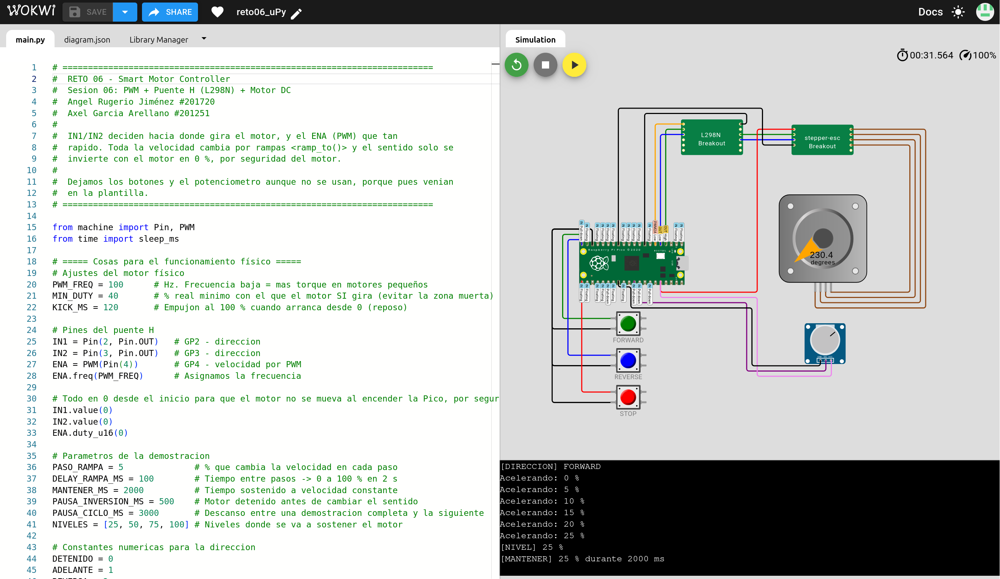

# Simulación en Wokwi

Trabajo en equipo: Angel Rugerio Jiménez (#201720) y Axel García Arellano (#201251).

- Enlace al proyecto: https://wokwi.com/projects/476181809960581121
- Captura: [`../evidence/simulation.png`](../evidence/simulation.png)

El circuito (`diagram.json`) es la plantilla oficial del curso sin modificar; el código que corre es [`../main.py`](../main.py).
